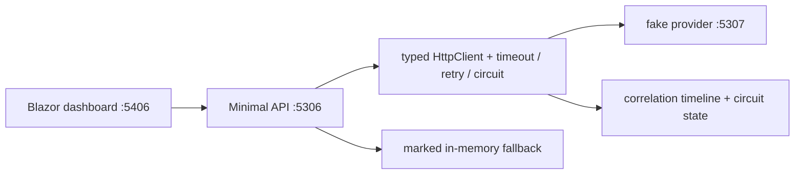

# Integration Resilience API

A .NET 9 vertical laboratory for studying an unstable customer-score integration.
It is intentionally small, backend-first, and optimized for GitHub/LinkedIn
portfolio discussion and senior engineering interviews.

## Objective

Call a local fake provider, make timeout/retry/circuit-breaker behavior explicit,
and never present a cached fallback as fresh data. The local Blazor dashboard is a
learning instrument, not a public/product UI (ADR-0005).

## Architecture

- `Contracts`: HTTP-facing records, separate from persistence.
- `Domain` and `Application`: score/fallback rules and integration boundary.
- `Infrastructure`: typed HttpClient, Polly pipeline, memory fallback, timeline.
- `Api`: Minimal API and ProblemDetails mapping.
- `FakeProvider`: deterministic `success`, `timeout`, `rate-limit`, `server-error`.
- `LearningDashboard`: calls the actual API and renders actual payloads/state.



## Run locally

In three terminals:

```powershell
dotnet run --project src/IntegrationResilience.FakeProvider --urls http://localhost:5307
dotnet run --project src/IntegrationResilience.Api --urls http://localhost:5306
dotnet run --project src/IntegrationResilience.LearningDashboard --urls http://localhost:5406
```

- API: http://localhost:5306
- Dashboard: http://localhost:5406
- Fake provider: http://localhost:5307

Or start the same real local components through Docker Compose:

```powershell
docker compose up --build
```

## Test

```powershell
dotnet test IntegrationResilience.sln
```

The test suite has domain/application tests, an HTTP pipeline test with
`WebApplicationFactory`, and a documentation governance test for the vision and
required ADRs.

## Learning flow

1. Open the dashboard and select **1. Seed success**.
2. Select **2. Trigger 503**. The cached response is explicitly `source=fallback`.
3. Inspect the response and timeline cards: attempts, retry delays, circuit open.
4. Select **5. Wait and recover** to observe the half-open probe and closure.

For the compact reading route and interview prompts, see [the study guide](docs/study-guide.md).

## Decisions Que Eu Consigo Defender Em Entrevista

- Typed `HttpClient` centralizes outbound HTTP configuration without leaking it to handlers (ADR-0002).
- A timeout is per attempt; retry is bounded and only targets transient conditions (ADR-0003).
- The breaker protects capacity, while correlation timeline/state makes its operation inspectable.
- Fallback carries source, age, and original failure class; an absent fallback is ProblemDetails, not invented data (ADR-0004).
- Blazor is intentionally local and observational, preserving a backend-first learning scope (ADR-0005).
